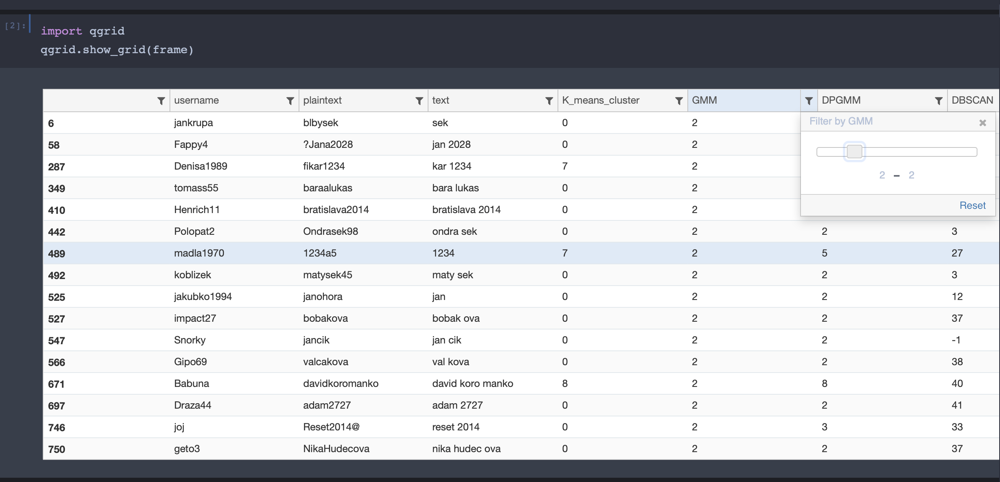

# Improve efficiency
There are a few things you can change for your jupyter notebook. 
- Themes
- nbextension
  - [Scratchpad](https://blog.csdn.net/yuxiaosmd/article/details/109348329?utm_medium=distribute.pc_blog_right_sidebar.none-task-blog-alirec-6.nonecase&depth_1-utm_source=distribute.pc_blog_right_sidebar.none-task-blog-alirec-6.nonecase) (shortcut: C-b)
  - 
## Themes ([ZHIHU][1])
To protect your eyes, it's time to change a dark theme. In order to do this, we need
### Install
```{bash}  
#Install the themes packages 
pip install jupyterthemes
```
### Look the themes list
```
jt -l
```
### Change your themes
```
# jt -t (the theme you like)
# For example
jt -t onedork  -N -T
# -N -T allows us to show the toolbar after changing the theme
```

### Change it back
```
jt -r
# then restart your jupyter notebook
```

## Use jupyter as excel ([ZHIHU][2])
We need a package named Qgrid.
### Install
By pip:
```
pip install qgrid
jupyter nbextension enable --py --sys-prefix qgrid
# only required if you have not enabled the ipywidgets nbextension yet
jupyter nbextension enable --py --sys-prefix widgetsnbextension
```
By conda:
```
# only required if you have not added conda-forge to your channels yet
conda config --add channels conda-forge
conda install qgrid
```
### Example of using qgrid
```{python}
import qgrid
qgrid.show_grid(your_data_name)
# data type: data.frame
```


## Other useful tools
...continue to update 

[1]: https://zhuanlan.zhihu.com/p/46242116
[2]: https://www.zhihu.com/question/59392251/answer/560977151
